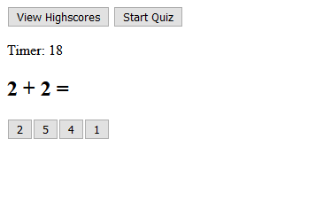
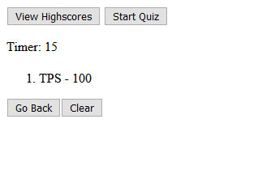

This project involves a series of functions that run and generate several quiz questions from an array of objects. It includes a timer based on set intervals.

Live project: https://thomassiopes.github.io/TS-04-Quiz-Generator-With-Timer/

